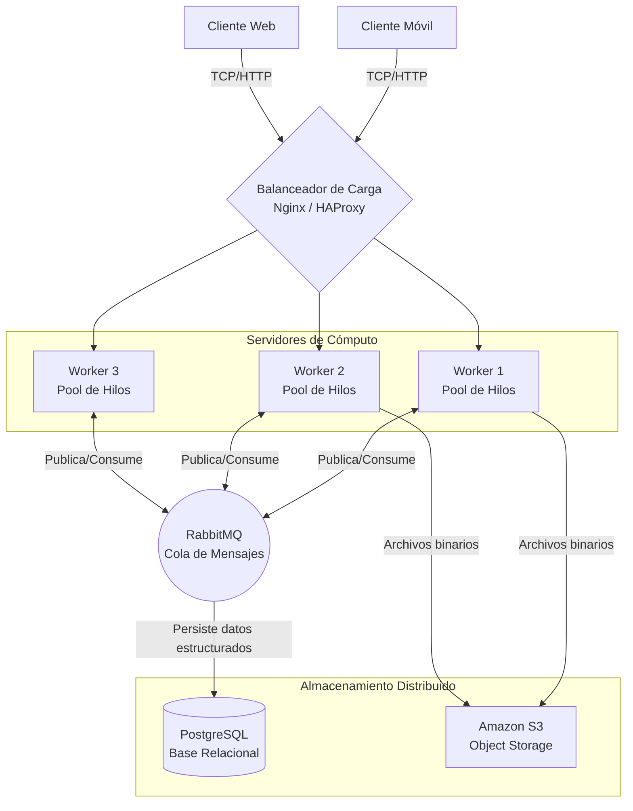

# Arquitectura Distribuida - PFO 3 PR.

```mermaid
graph TD
    %% Capa de Clientes
    C1[Cliente Móvil] -->|TCP/HTTP| LB
    C2[Cliente Web] -->|TCP/HTTP| LB

    %% Balanceador de Carga
    LB{Balanceador de Carga\nNginx / HAProxy}

    %% Capa de Procesamiento (Workers)
    subgraph Servidores de Cómputo
        W1[Worker 1\nPool de Hilos]
        W2[Worker 2\nPool de Hilos]
        W3[Worker 3\nPool de Hilos]
    end

    LB --> W1
    LB --> W2
    LB --> W3

    %% Comunicación Asíncrona
    W1 <-->|Publica/Consume| MQ((RabbitMQ\nCola de Mensajes))
    W2 <-->|Publica/Consume| MQ
    W3 <-->|Publica/Consume| MQ

    %% Capa de Persistencia
    subgraph Almacenamiento Distribuido
        DB[(PostgreSQL\nBase Relacional)]
        S3[Amazon S3\nObject Storage]
    end

    MQ -->|Persiste datos estructurados| DB
    W1 -->|Archivos binarios| S3
    W2 -->|Archivos binarios| S3
```
